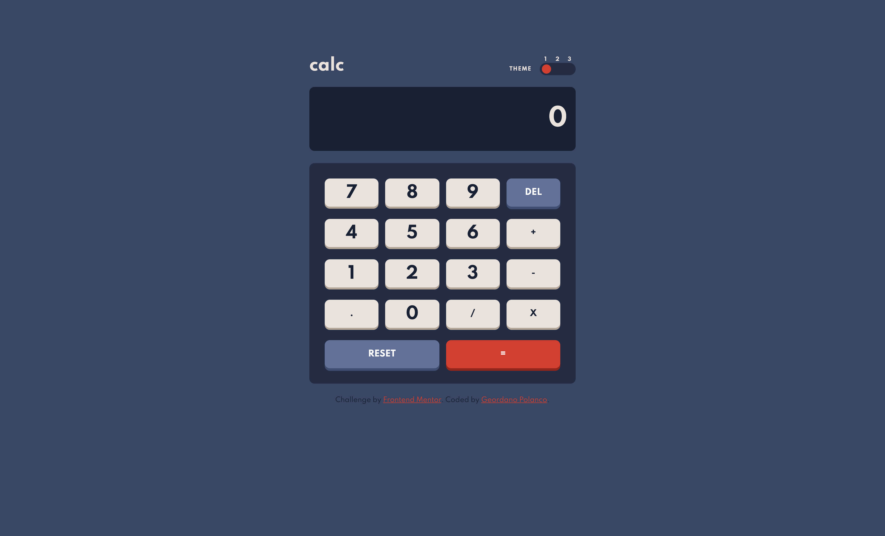

# Frontend Mentor - Calculator app solution

- [Overview](#overview)
  - [The challenge](#the-challenge)
  - [Screenshot](#screenshot)
  - [Links](#links)
- [My process](#my-process)
  - [Built with](#built-with)
  - [Features](#features)
- [Author](#author)

## Overview

Hello! This is my solution to the [Calculator app challenge on Frontend Mentor](https://www.frontendmentor.io/challenges/calculator-app-9lteq5N29) challenge. It was a very interesting challenge, especially in trying to make a reusable and readable code using EmaScript modules.

### The challenge

Your challenge is to build out this calculator app and get it looking as close to the design as possible.

You can use any tools you like to help you complete the challenge. So if you've got something you'd like to practice, feel free to give it a go.

- See the size of the elements adjust based on their device's screen size
- Perform mathematical operations like addition, subtraction, multiplication, and division
- Adjust the color theme based on their preference
- **Bonus**: Have their initial theme preference checked using `prefers-color-scheme` and have any additional changes saved in the browser

### Screenshot



### Links

- [Live demo](https://gpolanco.github.io/frontendmentor-challenges/)
- [Challenge solution](https://www.frontendmentor.io/solutions/ecmascript-module-mobile-first-css-using-var-bem-css-and-html-hFxrq1hQ7)
- [Frontend Mentor](https://www.frontendmentor.io/) challenges allow you to improve your skills in a real-life workflow.

## My process

### Built with

- Semantic HTML5 markup
- [CSS custom properties](https://developer.mozilla.org/en-US/docs/Web/CSS/--*)
- Mobile-first workflow
- [Flexbox](https://developer.mozilla.org/en-US/docs/Learn/CSS/CSS_layout/Flexbox)
- [CSS Grid Layout](https://developer.mozilla.org/es/docs/Web/CSS/CSS_Grid_Layout)
- [Vanilla JavaScript EcmaScript Modules](https://developer.mozilla.org/en-US/docs/Web/JavaScript/Guide/Modules)

### Features

- Using `import` and `export` with JavaScript native modules.

```js
// main.js
import { ToggleTheme } from "./toggle-teme.js";
import { Keyboard } from "./keyboard-control.js";

ToggleTheme.init();
Keyboard.init();
```

- Implement JavaScript modules using class

```javascript
// js/toggle-theme.js

class Toggle {
  // methods implementation
}

export const ToggleTheme = new Toggle();
```

- Usin css customer properties for toggle theme

```css
/* css/global.css */

:root {
  /* default values */
}

:root body[data-scheme="light"] {
  /* light theme values */
}

:root body[data-scheme="dark"] {
  /* dark theme values */
}
```

- Using css grid layout, to implement keyboard buttons

```css
.calc__keypad {
  grid-template-columns: repeat(4, 1fr);
  grid-template-rows: repeat(5, var(--button-height));
  gap: var(--keypad-gap-x) var(--keypad-gap-y);
}

/* Specific start / end column */
.cacl__button-reset {
  grid-column: 1/3;
}

.cacl__button-equal {
  grid-column: 3/5;
}
```

## Author

- Website - [Geordano Polanco](https://www.gpolanco.com)
- Frontend Mentor - [@gpolanco](https://www.frontendmentor.io/profile/gpolanco)
- Twitter - [@Geordano_Pr](https://twitter.com/Geordano_Pr)
